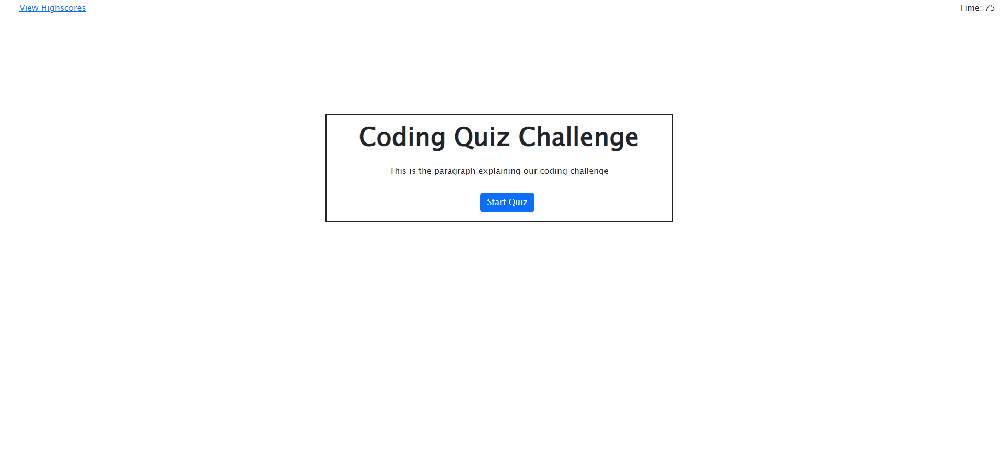
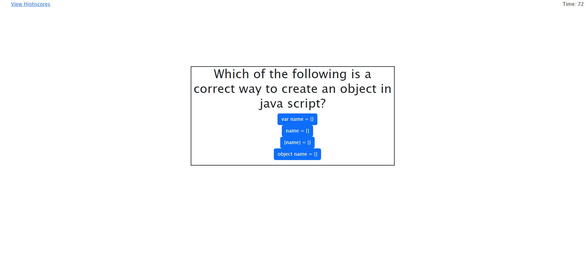
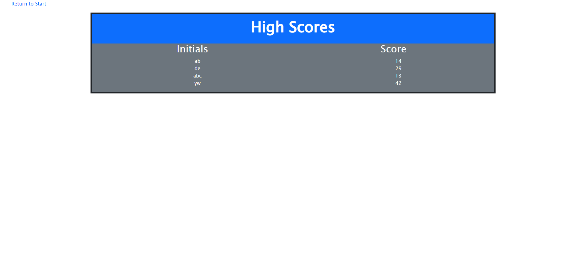

# Coding Quiz 
  
## Description

This project is to develop a coding quiz that a user takes and is able to store their score and initials on a high score page using local storage.  For this project I learned how to replace html text using innerhtml functionality  to change to different questions and answer options.

## Table of Contents

- [Installation](#installation)
- [Usage](#usage)
- [License](#license)
- [Contributing](#contributing)
- [Tests](#tests)
- [Questions](#questions)

## Installation

None.

## Usage

Click the start Quiz button to begin the quiz, and then click on teh answers that you choose and enter your initials when finished.

Screenshot1
Screenshot2
Screenshot3

## License

This project is not licensed.

## Contributing

I collaborated with Nick Rosales on this project.  His github is https://github.com/NickRosales

## Tests

There are no tests for this project.

## Questions

Github username: [Mpacct](https://www.github.com/Mpacct)

Email: marcuspacc@gmail.com

Link to Deployed Github: https://mpacct.github.io/Qizz-Application/

